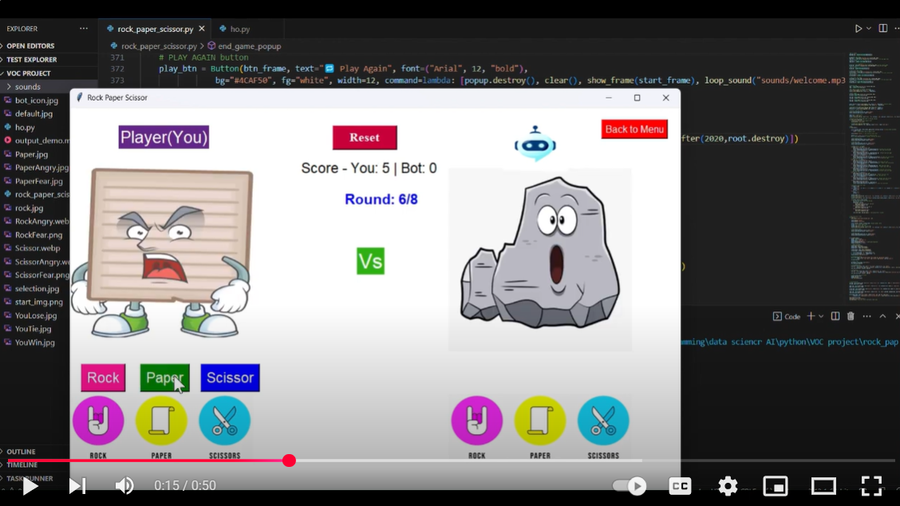

# Rock paper scissor **project**
I built this project during **vault of code python developer intern** as final project 

## 👤 Author  
**Ritam Mondal**  
Indian Institute of Technology (IIT), Kharagpur 
- Dual Degree, Industrial & Systems Engineering
- Indian Institute of Technology Kharagpur  
- connect me on:
  <p align="left">
  <a href="https://www.linkedin.com/in/ritam-mondal-86a369287/" target="_blank">
    </a>  
</p> 
  
- Email: ritamm134@gmail.com

## Overview:

A visually engaging and interactive Rock-Paper-Scissors game built using **Python**, **Tkinter**, **Pillow**, and **Pygame**. Includes animated effects, sound integration, and a clean GUI experience.

---


## 🎥 Gameplay output Demo

<video src="https://github.com/user-attachments/assets/507cff3d-6824-4045-8305-90dda6b5dc1d" controls width="200"> 
</video>

<h3>📺Also get Demo Video on youtube</h3>

<a href="https://youtu.be/h7aLM6nbdR4?si=ez2dnoBF5Usn3m4L" target="_blank">
  
</a>

---

## 📁 Folder Structure

rock_paper_scissor_project/

│

├── images/ # All image assets used in the UI

│ ├── start_img.png

│ ├── rock.png
          
│ ├── paper.png
               
│ └── scissor.png

│

├── sounds/ # Sound effects used in the game

│ ├── click.mp3

│ ├── win.mp3

│ └── lose.mp3

│

├── Notebook/ # (Optional) Jupyter notebooks used during development (for explanation)

│ └── development_notes.ipynb
│

├── dist/ # Output folder for the final .exe build (created by PyInstaller)

│ └── RockPaperScissor.exe
│

├── rock_paper_scissor.py # Main Python script

├── requirements.txt # All dependencies

├── README.md # You're reading it!

└── .gitignore # Files/folders to ignore in git


---

## 🚀 Features

- Tkinter-based GUI
- Mouse click & hover sound effects
- Animated transitions
- Multiplayer mode
- Display of scores
- Win/Loss feedback via visuals and audio

---
## Distribute
You can now send this `.exe` file to anyone!

📝 Download the [game_app.exe](game_app/rock_paper_scissor.exe) from here or from my [google drive](https://drive.google.com/file/d/13Q_PfoEbi8w4zo0vZ8KUyQ8lD3nb81p2/view?usp=sharing) : 

**Users don’t need Python installed to run the app.**
---

## 🖥️ How to Run (Locally) and build your own **poratble app**

### 1. Clone the repository

```bash
git clone https://github.com/ritammondal2004/rock_paper_scissor_gui.git
cd rock_paper_scissor_gui 
``` 

### 2. Set up virtual environment (Recommended)

```
python -m venv venv
venv\Scripts\activate   # Windows
source venv/bin/activate  # Linux/Mac
```

### 3. Install dependencies
```
pip install -r requirements_dev.txt
```

##  Build as Standalone Executable (.exe)
You can create a portable `.exe` version for Windows using `pyinstaller`. 

### 1. Install PyInstaller

```
pip install pyinstaller
```  
### 2. Navigate toyour project folder and Run PyInstaller to Create .exe
Run this command on command prompt

```
pyinstaller --noconfirm --onefile --windowed rock_paper_scissor.py
```

### 3. Build with resource path compatibility

```
pyinstaller --noconsole --onefile --add-data "images;images" --add-data "sounds;sounds" rock_paper_scissor.py

```
### 4. The executable will be inside:

```
dist/RockPaperScissor.exe
```
---


## Notes on Packaging
If Docker was used:

- Docker was only for portability and isolation.

- Final .exe doesn’t need Docker at all.

- You can delete images, containers once build is complete.
